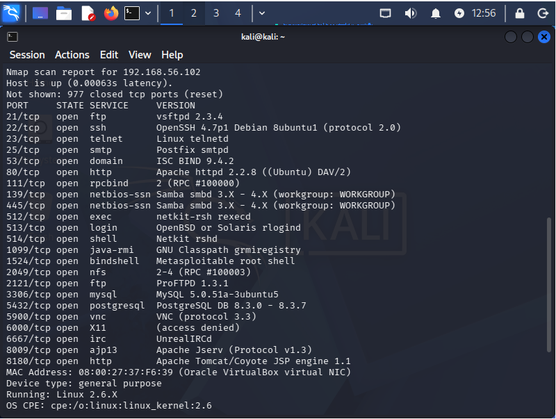
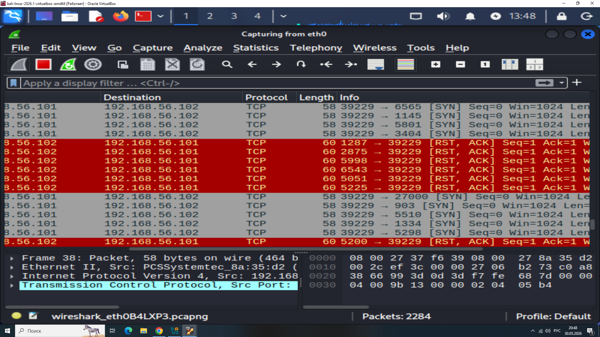
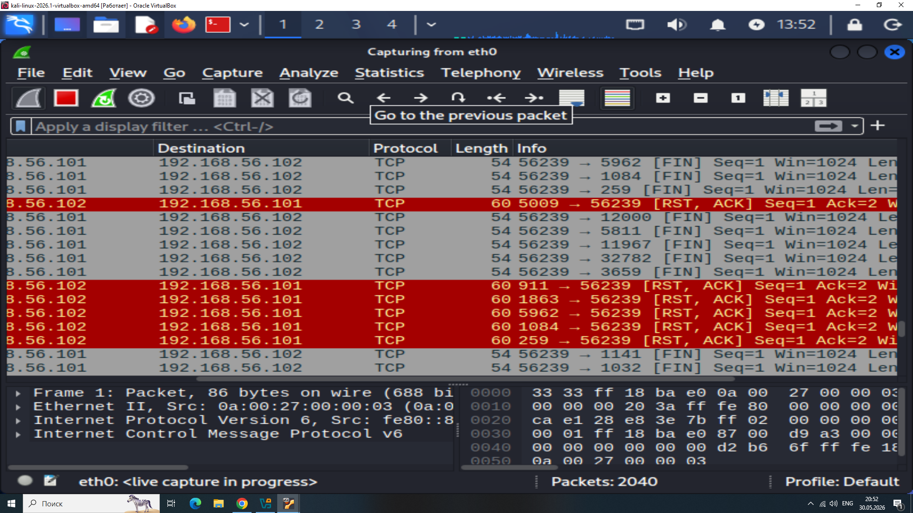
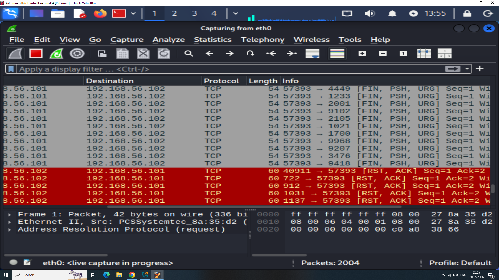
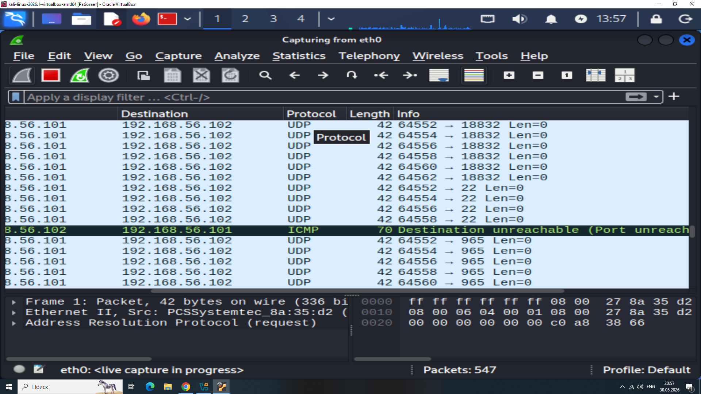

# Домашнее задание к занятию «Уязвимости и атаки на информационные системы»
### Золоторев Н.Д.

### Задание 1

Скачайте и установите виртуальную машину Metasploitable: https://sourceforge.net/projects/metasploitable/.

Это типовая ОС для экспериментов в области информационной безопасности, с которой следует начать при анализе уязвимостей.

Просканируйте эту виртуальную машину, используя nmap.

Попробуйте найти уязвимости, которым подвержена эта виртуальная машина.

Сами уязвимости можно поискать на сайте https://www.exploit-db.com/.

Для этого нужно в поиске ввести название сетевой службы, обнаруженной на атакуемой машине, и выбрать подходящие по версии уязвимости.

Ответьте на следующие вопросы:

    Какие сетевые службы в ней разрешены?
    Какие уязвимости были вами обнаружены? (список со ссылками: достаточно трёх уязвимостей)

Приведите ответ в свободной форме.

### Решение 1

1. https://www.exploit-db.com/exploits/17491
2. https://www.exploit-db.com/exploits/27407
3. https://www.exploit-db.com/exploits/30020

### Задание 2

Проведите сканирование Metasploitable в режимах SYN, FIN, Xmas, UDP.

Запишите сеансы сканирования в Wireshark.

Ответьте на следующие вопросы:

    Чем отличаются эти режимы сканирования с точки зрения сетевого трафика?
    Как отвечает сервер?

Приведите ответ в свободной форме.

### Решение 2

Отличия в трафике:

    SYN → отправляет обычный SYN, получает SYN+ACK (открыт) или RST (закрыт).

    FIN → отправляет FIN, получает тишину (открыт) или RST (закрыт).

    Xmas → отправляет FIN+PSH+URG, получает тишину (открыт) или RST (закрыт).

    UDP → отправляет UDP-пакет, получает тишину (открыт) или ICMP Port Unreachable (закрыт).

Как отвечает сервер:

    На SYN → честно отвечает SYN+ACK или RST.

    На FIN / Xmas → на открытые порты молчит (игнорирует), на закрытые шлёт RST.

    На UDP → на открытые молчит, на закрытые шлёт ICMP "порт недоступен".

SYN:

FIN:

Xmas:

UDP:

